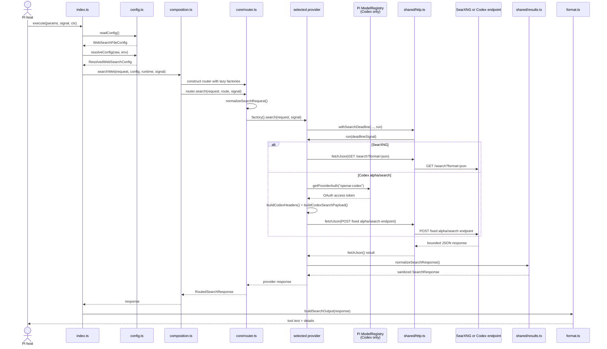

# Web search extension architecture

This extension is a Pi integration layer around one public tool, `web_search`. It
normalizes a search request, selects one of two provider adapters, and returns a
single sanitized response. It is not a model provider and does not own OAuth
storage or token refresh.

## Layer map

```text
Pi host
└── index.ts
    ├── registerWebSearchTool()  -> tool schema, progress and execution boundary
    └── registerWebSearchCommand() -> read-only /web-search diagnostics

Tool/command boundary
├── config.ts       -> read, parse and resolve web-search-config.json
├── composition.ts  -> lazy provider factories and runtime dependency injection
└── format.ts       -> one safe response -> Pi tool text and details

Core
├── core/types.ts       -> SearchRequest, SearchResponse and SearchProvider contracts
├── core/validation.ts  -> request normalization and bounds
├── core/router.ts      -> provider selection, fallback and cancellation checks
└── core/errors.ts      -> classified errors safe for Pi-facing messages

Adapters
├── providers/searxng/  -> URL/auth validation, SearXNG request and response shape
└── providers/codex/    -> model/auth validation, Pi OAuth and alpha/search wire shape

Shared boundaries
├── shared/http.ts      -> deadline, abort propagation, redirect rejection and JSON limits
├── shared/results.ts   -> URL policy, redaction, domain filtering, deduplication and field limits
└── shared/limits.ts    -> common timeout, result, response and output limits
```

Configuration is read-only at runtime. URL and SearXNG key values come from
`SEARXNG_URL` and `SEARXNG_API_KEY`; the JSON file contains the routing rules
and remaining persistent settings.

The dependency direction is intentional:

- `core` depends on contracts and shared safety primitives, not on a concrete
  provider.
- `composition.ts` is the only module that assembles concrete providers. The
  router receives lazy factories, so an unused provider is not constructed.
- Provider-specific configuration, authentication and wire formats stay under
  that provider's directory.
- Providers return a bounded, sanitized `SearchResponse`; the router does not
  replace its query or re-sanitize it with raw input.
- `format.ts` derives both the visible tool text and `details` from the same
  sanitized response.

There is deliberately no provider base class, global secret registry, token
cache or plugin framework.

## Abstract method call chain

The startup and normal tool path are:

```text
webSearchExtension(pi)
├─ registerWebSearchTool(pi)
│  └─ execute(toolCallId, params, signal, onUpdate, ctx)
│     ├─ readConfig()
│     ├─ resolveConfig(rawConfig, env)
│     ├─ onUpdate("Searching <provider>...")
│     ├─ searchWeb(request, resolvedConfig, runtime, signal)
│     │  ├─ new WebSearchRouter(lazyProviderFactories)
│     │  └─ router.search(request, route, signal)
│     │     ├─ normalizeSearchRequest(request)
│     │     ├─ providerFactory().search(normalizedRequest, signal)
│     │     │  ├─ withSearchDeadline(provider, timeout, signal, run)
│     │     │  ├─ fetchJson(...)
│     │     │  └─ normalizeSearchResponse(...)
│     │     ├─ optionally try routing.fallbackProvider when enabled
│     │     └─ return RoutedSearchResponse
│     ├─ buildSearchOutput(response)
│     └─ return { content, details }
└─ registerWebSearchCommand(pi)
```

The same chain as an interaction sequence:



`withSearchDeadline()` surrounds authentication (when needed), the network
request and response-body consumption. `fetchJson()` rejects redirects, bounds
the streamed body, and converts status/transport failures into classified
errors. `normalizeSearchResponse()` is the output boundary: it removes unsafe
URLs and sensitive reflections, applies domain filtering and deduplication, and
bounds fields before data can reach the router or Pi.

## Provider branches

### SearXNG

When the route selects `searxng`, the factory creates a provider with the
resolved base URL, optional Bearer key, timeout and injected
fetch implementation. The adapter:

1. validates the URL and authenticated-HTTP policy;
2. maps `domains` and coarse `recencyDays` to SearXNG query parameters;
3. performs `GET {baseUrl}/search?format=json`;
4. extracts SearXNG result fields; and
5. passes candidates through the common result normalizer.

### Codex alpha/search

When the route selects `codex-alpha-search`, the factory creates a provider with
the resolved model, timeout and an auth resolver. The adapter:

1. asks Pi's `ModelRegistry` for `openai-codex` provider auth;
2. requires Pi-resolved `source: "OAuth"` and derives the account ID in memory;
3. builds only the required headers and the alpha/search payload;
4. posts to the fixed `https://chatgpt.com/backend-api/codex/alpha/search`
   endpoint; and
5. extracts structured results/Markdown citations and uses the common result
   normalizer.

The extension never reads `auth.json`, persists the token, refreshes OAuth
itself, or accepts a Codex token/endpoint from `web-search-config.json`.

## Routing and fallback

`routing.provider`, `routing.fallback` and `routing.fallbackProvider` are
resolved from the JSON file and passed to `WebSearchRouter.search()`. The router
tries the selected provider first. If fallback is enabled, it lazily constructs
and tries the configured fallback provider only for an eligible classified
provider failure. Invalid requests/configuration and cancellation do not trigger
a fallback. If no fallback provider is configured, the other registered adapter
is used. The returned `provider` identifies the adapter that produced the
response.

Fallback is opt-in because a failure of local SearXNG can otherwise disclose the
query to the Codex service. `/web-search test` always disables fallback for the
individual test request.

## Command paths

```text
/web-search status
└─ readConfig() -> resolveConfig() -> getProviderAuthStatus() -> ui.notify()

/web-search test <provider>
└─ readConfig() -> resolveConfig() -> provider override + fallback=false
   -> searchWeb() -> ui.notify(result count)
```

There is no interactive configuration command. Edit
`~/.pi/agent/web-search-config.json` directly; keep SearXNG URL and key values in
the environment.

Command status intentionally reports configuration presence/source and safe
authentication state, not URLs, model values, keys, headers or registry
implementation details.

## Main contracts

| Contract | Meaning |
| --- | --- |
| `SearchRequest` | Normalized query, result limit, optional host filters and approximate recency. |
| `SearchProvider` | Provider-neutral search operation over a normalized request. |
| `SearchResponse` | Sanitized query, normalized results, optional summary and truncation metadata. |
| `RoutedSearchResponse` | A `SearchResponse` with the provider that succeeded. |
| `SearchRuntime` | Testable host dependencies, currently Pi's model registry and `fetch`. |
| `WebSearchError` | Allowlisted failure code and safe metadata; raw provider bodies are excluded. |

